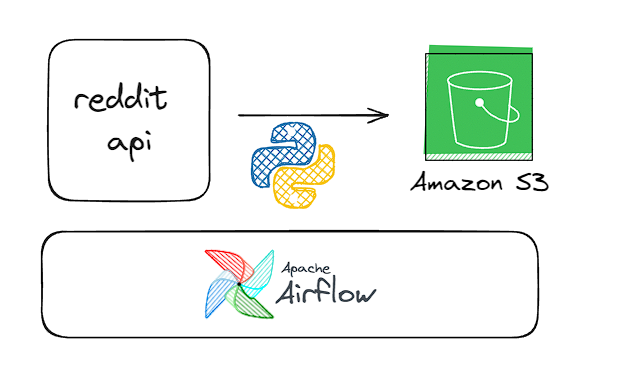

# Projeto

Basicamente esse projeto é um etl simples que extrai os titulos de subreddits e armazena em um bucket de s3, tudo isso
orquestrado com apache airflow.

## Motivação

Quero ver qual dos subreddits que peguei os titulos tem a maior repetição de perguntas, provavelmente
vou usar usando LZ77 pra comprimir os dados e ver qual tem maior diminuição, mas é uma apenas uma hipótese.

## How to run?

### Terraform

Para rodar o terraform você deve ter configurado o aws cli e terraform no seu pc
e simplesmente rode

```
    terraform init
    terraform plan
    terraform apply
```

### Airflow

Para rodar o airflow você deve ter configurado o .env as credenciais de cada dos itens, pois precisa de acesso
a api do reddit e também os acessos da aws para armazenar no bucket

rode
```
docker compose up - d
```


A arquitetura do script é simples como parece e como deve ser

